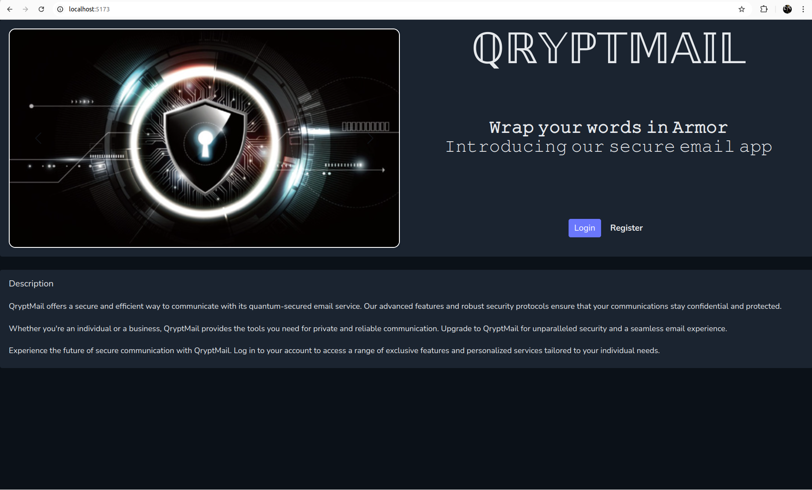
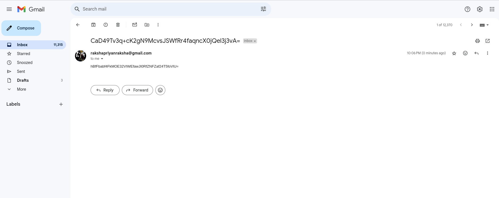
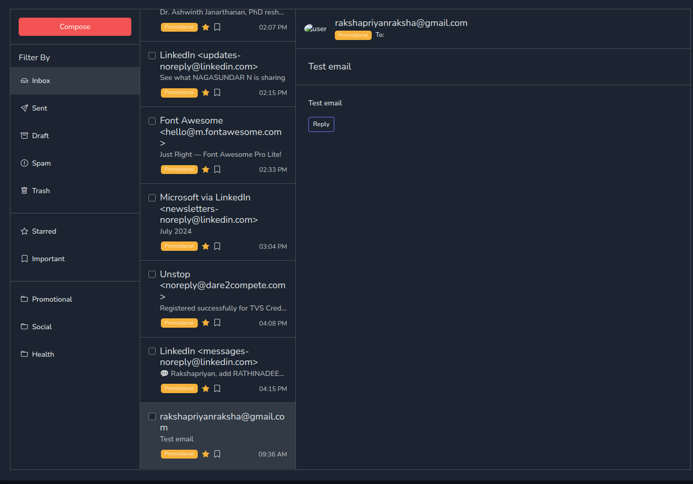

# Qrypt Mail - A Third-Party Web Application for Enhanced Email Privacy

Qrypt Mail is a third-party web application that allows users to log in to their Gmail accounts using their email ID and app password. With Qrypt Mail, users can send secure emails that can only be decrypted and read by recipients using the Qrypt Mail application.



## Features

### Two Levels of Email Security
- **Level 1**: Send emails without any additional encryption. These emails can be read in any email client.
- **Level 2**: Send emails with custom AES-256 encryption. These emails can only be decrypted and read using the Qrypt Mail application. If viewed in any other email client, such as Gmail, only the encrypted message will be displayed.

### Level 2: Mail Protected with Custom AES-256 Encryption
Emails sent through Level 2 use custom AES-256 encryption. This ensures that only the intended recipient, who has the Qrypt Mail application and the correct credentials, can decrypt and read the message. This adds an extra layer of security to your communication.



*The image above shows the encrypted message when viewed in the Gmail application.*



*The image above shows the decrypted message when viewed in the Qrypt Mail application.*

### Compatibility
Emails received from other users can be viewed normally, just like in the Gmail application.


## Technologies Used
- **Backend**: FastAPI and Python
- **Frontend**: Vite.js
- **Database**: MySQL

## Getting Started

### Prerequisites
- Python 3.8 or higher
- Node.js and npm
- MySQL

### Installation

1. **Clone the repository**
   ```bash
   git clone https://github.com/rakshapriyan/qryptmail.git
   cd qryptmail

### Backend Setup
1. **Create a virtual environment and activate it**:
   ```bash
   python -m venv venv
   source venv/bin/activate  # On Windows use `venv\Scripts\activate`

2. **Install the Required packages**:
   ```bash
   pip install -r requirements.txt


   
3. **Create mysql Database**:
   ```bash
   CREATE DATABASE qryptmail;


# Frontend Setup

1. **Navigate to the frontend directory**:

  ```bash
  cd frontend
```

2. **Install the required packages**:
  ```bash
  npm install

